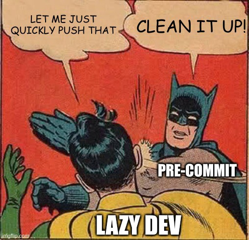
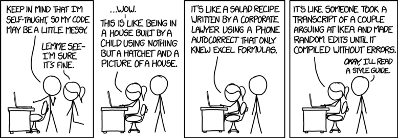

## Contributing Guidelines

Thank you for considering contributing to our database repository. Your contributions are valuable and help improve the quality of our work.

Our repository follows the [FAIR (Findable, Accessible, Interoperable, and Reusable)](https://www.nature.com/articles/sdata201618) principles, which promote the usability and long-term value of data and resources.
As a contributor, it is important to adhere to these principles and pay attention to metadata and data quality.

Thus when you add the simulation to the database be sure to specify the arguments `subset_name`, `task`, `user`.
Additionally, when updating metadata, use the `update_metadata` function to ensure that the information accurately reflects the latest changes and additions.

## Data submission process

1.  **Fork** the repository on GitHub by clicking the "Fork" button.

2.  Clone your forked repository locally using the following command:

    ```bash
    git clone https://github.com/<your-github-username>/Enhancing_ReaxFF_DFT_database.git
    ```

3.  Make the necessary changes to your local repository.

4.  (Optional) Install the pre-commit hook to perform code checks before committing your changes.

5.  Pull and rebase any changes made by others to the main branch since you started working on your changes:

    ```bash
    git pull --rebase
    ```

6.  If you have committed multiple changes locally, squash them into a single commit before submitting a pull request (PR). You can do this by following these steps:

    *   Run `git log` to find the commit ID of your first local commit.

    *   Use the commit ID to rebase and squash the commits by running:

        ```bash
        git rebase <FIRST-COMMIT-ID> -i
        ```

    *   Mark all of the commits except the first as "squash" in the interactive rebase window.

    Note: We prefer a single commit as the first revision of a PR for easier review.

7.  Push your changes to your forked repository:

```bash
git push -f fork master
```

Note: Use the `-f` option if you have used your fork for previous PRs.

8.  Go to your forked repository on GitHub and click the "New pull request" button to create a new pull request.

9.  If your reviewers provide feedback, make the necessary changes locally, rerun the tests, and update your forked repository:

    ```bash
    git push fork main
    ```

    Note: Do not squash commits after the PR has been sent, as it resets the state held by GitHub about what files each reviewer has seen.

10. If additional changes have been made to the main branch and you need to update your fork, pull the changes as a merge (not a rebase):

    ```bash
    git pull
    git push fork main
    ```

    Note: Using merges instead of rebases allows GitHub to hide the content of merge commits, reducing noise in the commit history.

11. Once the reviewer approves your change with LGTM, it's time to submit. Use the "Squash and merge" option when merging to the main branch. We use squash merging to maintain a clean commit history in the master branch.

12. For a step-by-step tutorial on contributing to GitHub, check out [How to Contribute on GitHub](https://www.dataschool.io/how-to-contribute-on-github/).

## How pre-commit

### What it is `pre-commit`?

`pre-commit` is a mechanism provided by the version control system Git that allows to execute code checks right before committing your changes.
It helps ensure code quality by catching potential issues such as typos or style mistakes.

Besicaly force lazy developers to control his code to avoid stupid
typos or style mistakes.

<p align="center">
 
</p>

### Why I should use `pre-commit`?

When coding, it's easy to follow your own style and logic, which can sometimes result in chaotic and hard-to-read code. `pre-commit` helps mitigate this by enforcing code checks, preventing situations like the infamous "Spaghetti Code."

Thus, with `pre-commit` we are trying to basically avoid the situation below:

<p align="center">
 
</p>

### How to use `pre-commit`

Our repository includes a configuration file (`.pre-commit-config.yaml`) for `pre-commit` hooks.
Follow these steps to set it up:

1.  Install `pre-commit` using pip:

    ```bash
    pip install pre-commit
    ```

2.  Activate `pre-commit` to run before every `git commit`:

    ```bash
    pre-commit install
    ```

3.  Test it by running:

    ```bash
    pre-commit run
    ```

> **Note**
>
> To commit without running `pre-commit`, you can use the `git commit --no-verify` command.
> However, this will fail in the remote repository due to the "Continous Integration" workflow that checks all changes on every push and pull.

#### Hooks list:

| Hook | auto-fix |
| :---: | :---: |
| [pre-commit-hooks](https://github.com/pre-commit/pre-commit-hooks) | ✅ |
| [isort](https://github.com/timothycrosley/isort) | ✅ |
| [pyupgrade](https://github.com/asottile/pyupgrade) | ✅ |
| [black](https://github.com/psf/black) | ✅ |
| [blacken-docs](https://github.com/asottile/blacken-docs) | ✅ |
| [nbQA](https://github.com/nbQA-dev/nbQA) | ✅ and ❌ |
| [flake8](https://github.com/PyCQA/flake8) | ❌ |
| [mypy](https://github.com/pre-commit/mirrors-mypy) | ❌ |

> **Note**
>
> Note that many of these hooks can automatically fix code issues. If the checks fail, try running `git commit` again, and the hook will pass successfully.
